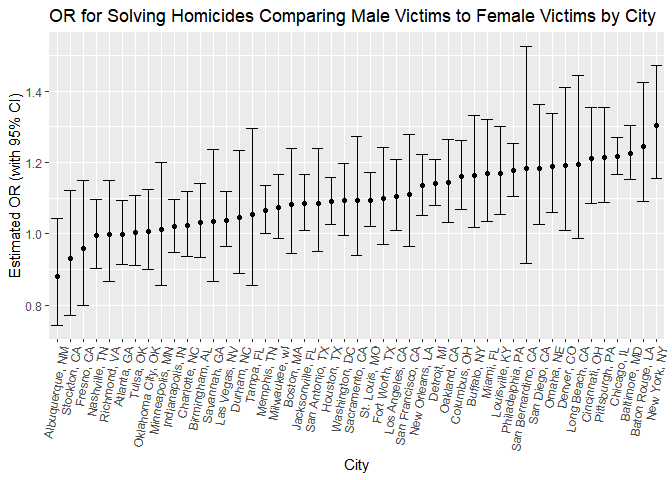
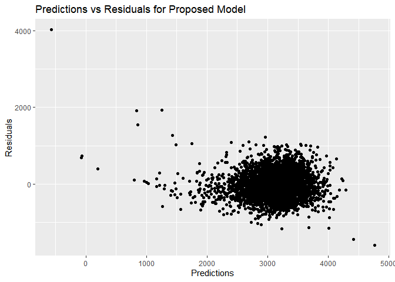
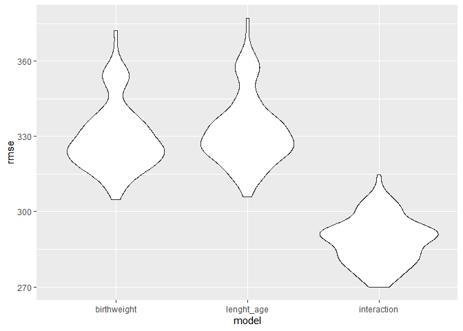

p8105_hw6_xs2569
================
XunSun
2024-12-02

### Problem 2 Homicide data

``` r
raw_homicide = read.csv("./data/homicide-data.csv")

#viewing variables
head(raw_homicide)
```

    ##          uid reported_date victim_last victim_first victim_race victim_age
    ## 1 Alb-000001      20100504      GARCIA         JUAN    Hispanic         78
    ## 2 Alb-000002      20100216     MONTOYA      CAMERON    Hispanic         17
    ## 3 Alb-000003      20100601 SATTERFIELD      VIVIANA       White         15
    ## 4 Alb-000004      20100101    MENDIOLA       CARLOS    Hispanic         32
    ## 5 Alb-000005      20100102        MULA       VIVIAN       White         72
    ## 6 Alb-000006      20100126        BOOK    GERALDINE       White         91
    ##   victim_sex        city state      lat       lon           disposition
    ## 1       Male Albuquerque    NM 35.09579 -106.5386 Closed without arrest
    ## 2       Male Albuquerque    NM 35.05681 -106.7153      Closed by arrest
    ## 3     Female Albuquerque    NM 35.08609 -106.6956 Closed without arrest
    ## 4       Male Albuquerque    NM 35.07849 -106.5561      Closed by arrest
    ## 5     Female Albuquerque    NM 35.13036 -106.5810 Closed without arrest
    ## 6     Female Albuquerque    NM 35.15111 -106.5378        Open/No arrest

``` r
view(raw_homicide)
```

The data set has 52,179 observations and 12 columns.

``` r
#creating a city_state variable
washington_df = raw_homicide |>
  mutate(
    city_state = paste(city, state, sep=", "),
    solved = ifelse(disposition == "Closed by arrest", 1, 0)) |>
  filter(
    !(city_state %in% c("Dallas, TX", "Phoenix, AZ", "Kansas City, MO", "Tulsa, AL")
    ),
    victim_race %in% c("Black", "White")) |>
  mutate(
    victim_age = as.numeric(victim_age)) |>
  drop_na() |>
  mutate(
  victim_sex = fct_relevel(victim_sex, "Male"))
view(washington_df)
```

\####Baltimore, MD

``` r
baltimore_data = washington_df %>% 
  filter(city_state == "Baltimore, MD")
fit_logistic = 
  baltimore_data |> 
  glm(solved ~ victim_sex + victim_race + victim_age, data = _, family = binomial()) 

fit_logistic |> 
  broom::tidy() |> 
  mutate(
    OR = exp(estimate),
    CI_upper = exp((estimate) + 1.96*(std.error)),
    CI_lower = exp((estimate) - 1.96*(std.error))) |>
  select(term, log_OR = estimate, OR, p.value, CI_upper, CI_lower) |> 
  knitr::kable(digits = 3)
```

| term             | log_OR |    OR | p.value | CI_upper | CI_lower |
|:-----------------|-------:|------:|--------:|---------:|---------:|
| (Intercept)      | -0.544 | 0.580 |   0.000 |    0.716 |    0.470 |
| victim_sexFemale |  0.854 | 2.350 |   0.000 |    3.081 |    1.793 |
| victim_raceWhite |  0.842 | 2.320 |   0.000 |    3.268 |    1.648 |
| victim_age       | -0.007 | 0.993 |   0.043 |    1.000 |    0.987 |

The odds of a homicide of Baltimore being solved when the victim was a
male was 2.35, which is significant with the interval (95% CI: 3.081,
1.793) times the odds of a homicide being solved when the victim was a
female, controlling for the victim’s age and race. The beta estimate for
this adjusted odds ratio is 0.580 which means the odds of solving a
homicide are 0.580 (or 58%) of the odds at a hypothetical baseline of 1,
given: the victim is male (reference level for victim_sex), the victim
is Black (reference level for victim_race) and the victim’s age is at 0.

#### Each of the cities

``` r
nest_glm_city_state =
  washington_df |> 
  nest(data = -city_state) |> 
  mutate(
    models = map(data, \(df) glm(solved ~ victim_sex + victim_race + victim_age, data = df)),
    results = map(models, broom::tidy)) |> 
  select(-data, -models) |> 
  unnest(results)

## Because the sample is large enough, we use normal disturbution and 1.96 to generate CI
nest_glm_city_state |> 
  select(term, estimate, city_state, std.error, p.value) |>
  mutate(
    term = fct_inorder(term),
    OR = exp(estimate),
    CI_upper = exp((estimate) + 1.96*(std.error)),
    CI_lower = exp((estimate) - 1.96*(std.error))) |> 
  select(estimate, term, city_state, OR, CI_upper, CI_lower)|>
  filter(
    term == "victim_sexFemale"
  )|>
  pivot_wider(
    names_from = term, values_from = estimate)|>
  knitr::kable(digits = 3)
```

| city_state         |    OR | CI_upper | CI_lower | victim_sexFemale |
|:-------------------|------:|---------:|---------:|-----------------:|
| Albuquerque, NM    | 0.882 |    1.044 |    0.745 |           -0.126 |
| Atlanta, GA        | 0.999 |    1.092 |    0.914 |           -0.001 |
| Baltimore, MD      | 1.226 |    1.305 |    1.152 |            0.204 |
| Baton Rouge, LA    | 1.246 |    1.425 |    1.091 |            0.220 |
| Birmingham, AL     | 1.033 |    1.143 |    0.934 |            0.033 |
| Boston, MA         | 1.082 |    1.241 |    0.944 |            0.079 |
| Buffalo, NY        | 1.164 |    1.331 |    1.017 |            0.152 |
| Charlotte, NC      | 1.024 |    1.118 |    0.937 |            0.023 |
| Chicago, IL        | 1.217 |    1.269 |    1.167 |            0.196 |
| Cincinnati, OH     | 1.212 |    1.353 |    1.086 |            0.192 |
| Columbus, OH       | 1.160 |    1.261 |    1.067 |            0.149 |
| Denver, CO         | 1.193 |    1.410 |    1.009 |            0.177 |
| Detroit, MI        | 1.142 |    1.208 |    1.080 |            0.133 |
| Durham, NC         | 1.047 |    1.233 |    0.890 |            0.046 |
| Fort Worth, TX     | 1.099 |    1.242 |    0.972 |            0.094 |
| Fresno, CA         | 0.959 |    1.149 |    0.800 |           -0.042 |
| Houston, TX        | 1.090 |    1.157 |    1.027 |            0.086 |
| Indianapolis, IN   | 1.020 |    1.096 |    0.949 |            0.020 |
| Jacksonville, FL   | 1.084 |    1.165 |    1.009 |            0.081 |
| Las Vegas, NV      | 1.039 |    1.119 |    0.965 |            0.038 |
| Long Beach, CA     | 1.194 |    1.445 |    0.986 |            0.177 |
| Los Angeles, CA    | 1.105 |    1.208 |    1.011 |            0.100 |
| Louisville, KY     | 1.170 |    1.300 |    1.054 |            0.157 |
| Memphis, TN        | 1.066 |    1.136 |    1.001 |            0.064 |
| Miami, FL          | 1.170 |    1.322 |    1.035 |            0.157 |
| Milwaukee, wI      | 1.073 |    1.167 |    0.987 |            0.071 |
| Minneapolis, MN    | 1.013 |    1.200 |    0.856 |            0.013 |
| Nashville, TN      | 0.996 |    1.097 |    0.904 |           -0.004 |
| New Orleans, LA    | 1.134 |    1.223 |    1.052 |            0.126 |
| New York, NY       | 1.304 |    1.473 |    1.155 |            0.266 |
| Oakland, CA        | 1.143 |    1.265 |    1.033 |            0.134 |
| Oklahoma City, OK  | 1.006 |    1.123 |    0.902 |            0.006 |
| Omaha, NE          | 1.190 |    1.338 |    1.059 |            0.174 |
| Philadelphia, PA   | 1.177 |    1.252 |    1.106 |            0.163 |
| Pittsburgh, PA     | 1.214 |    1.356 |    1.088 |            0.194 |
| Richmond, VA       | 0.997 |    1.149 |    0.866 |           -0.003 |
| San Antonio, TX    | 1.085 |    1.239 |    0.950 |            0.081 |
| Sacramento, CA     | 1.093 |    1.274 |    0.939 |            0.089 |
| Savannah, GA       | 1.035 |    1.237 |    0.867 |            0.035 |
| San Bernardino, CA | 1.182 |    1.525 |    0.916 |            0.167 |
| San Diego, CA      | 1.184 |    1.363 |    1.028 |            0.169 |
| San Francisco, CA  | 1.110 |    1.278 |    0.965 |            0.105 |
| St. Louis, MO      | 1.094 |    1.172 |    1.020 |            0.089 |
| Stockton, CA       | 0.930 |    1.122 |    0.771 |           -0.072 |
| Tampa, FL          | 1.054 |    1.297 |    0.856 |            0.052 |
| Tulsa, OK          | 1.005 |    1.109 |    0.910 |            0.005 |
| Washington, DC     | 1.093 |    1.198 |    0.996 |            0.089 |

``` r
nest_glm_city_state |> 
  filter(
    term == "victim_sexFemale") |>
  mutate(city_state = fct_reorder(city_state, exp(estimate))) |>
  ggplot(aes(x = city_state, y = exp(estimate))) + 
  geom_point() + 
  geom_errorbar(aes(x=city_state, 
        ymin = exp((estimate) + 1.96*(std.error)), 
        ymax = exp((estimate) - 1.96*(std.error)))) +
  theme(axis.text.x = element_text(angle = 80, hjust = 1)) +
  labs(
    title = "OR for Solving Homicides Comparing Male Victims to Female Victims by City",
    x = "City",
    y = "Estimated OR (with 95% CI)"
  )
```

<!-- --> The
plot highlights the variety of confidence interval widths, with wider
intervals occurring at the lower and higher OR values. From the plot we
can see all of the intervals contain the point 1.0 and there isn’t any
one of the upper level less than 1.0 but some of the intervals have the
lower level higher than 1.0. It also makes it evident that around half
of the ORs have confidence intervals that include the null value of 1,
indicating that though almost all estimates are greater than 1, they are
not all statistically significant.

### Problem 3

``` r
#loading csv
raw_birthweight_df = read.csv(file = "./data/birthweight.csv")

#viewing variables
head(raw_birthweight_df)
```

    ##   babysex bhead blength  bwt delwt fincome frace gaweeks malform menarche
    ## 1       2    34      51 3629   177      35     1    39.9       0       13
    ## 2       1    34      48 3062   156      65     2    25.9       0       14
    ## 3       2    36      50 3345   148      85     1    39.9       0       12
    ## 4       1    34      52 3062   157      55     1    40.0       0       14
    ## 5       2    34      52 3374   156       5     1    41.6       0       13
    ## 6       1    33      52 3374   129      55     1    40.7       0       12
    ##   mheight momage mrace parity pnumlbw pnumsga    ppbmi ppwt smoken wtgain
    ## 1      63     36     1      3       0       0 26.27184  148      0     29
    ## 2      65     25     2      0       0       0 21.34485  128      0     28
    ## 3      64     29     1      0       0       0 23.56517  137      1     11
    ## 4      64     18     1      0       0       0 21.84508  127     10     30
    ## 5      66     20     1      0       0       0 21.02642  130      1     26
    ## 6      66     23     1      0       0       0 18.60030  115      0     14

``` r
view(raw_birthweight_df)
```

#### Load and clean the data

``` r
birthweight_df = raw_birthweight_df |>
  mutate(
    mrace = 
      case_match(mrace,
        1 ~ "White", 
        2 ~ "Black", 
        3 ~ "Asian",
        4 ~ "Puerto Rican",
        8 ~ "Other"),
    babysex = 
      case_match(babysex,
        1 ~ "Male",
        2 ~ "Female"),
    frace = 
      case_match(frace,
        1 ~ "White", 
        2 ~ "Black", 
        3 ~ "Asian",
        4 ~ "Puerto Rican",
        8 ~ "Other",
        9 ~ "Unknown")
  ) |>
  drop_na() |>
  mutate(
    babysex = as.factor(babysex),
    blength = as.numeric(blength),
    ppwt = as.numeric(ppwt))

str(birthweight_df)
```

    ## 'data.frame':    4342 obs. of  20 variables:
    ##  $ babysex : Factor w/ 2 levels "Female","Male": 1 2 1 2 1 2 1 1 2 2 ...
    ##  $ bhead   : int  34 34 36 34 34 33 33 33 36 33 ...
    ##  $ blength : num  51 48 50 52 52 52 46 49 52 50 ...
    ##  $ bwt     : int  3629 3062 3345 3062 3374 3374 2523 2778 3515 3459 ...
    ##  $ delwt   : int  177 156 148 157 156 129 126 140 146 169 ...
    ##  $ fincome : int  35 65 85 55 5 55 96 5 85 75 ...
    ##  $ frace   : chr  "White" "Black" "White" "White" ...
    ##  $ gaweeks : num  39.9 25.9 39.9 40 41.6 ...
    ##  $ malform : int  0 0 0 0 0 0 0 0 0 0 ...
    ##  $ menarche: int  13 14 12 14 13 12 14 12 11 12 ...
    ##  $ mheight : int  63 65 64 64 66 66 72 62 61 64 ...
    ##  $ momage  : int  36 25 29 18 20 23 29 19 13 19 ...
    ##  $ mrace   : chr  "White" "Black" "White" "White" ...
    ##  $ parity  : int  3 0 0 0 0 0 0 0 0 0 ...
    ##  $ pnumlbw : int  0 0 0 0 0 0 0 0 0 0 ...
    ##  $ pnumsga : int  0 0 0 0 0 0 0 0 0 0 ...
    ##  $ ppbmi   : num  26.3 21.3 23.6 21.8 21 ...
    ##  $ ppwt    : num  148 128 137 127 130 115 105 119 105 145 ...
    ##  $ smoken  : num  0 0 1 10 1 0 0 0 0 4 ...
    ##  $ wtgain  : int  29 28 11 30 26 14 21 21 41 24 ...

``` r
birthweight_df = as.data.frame(birthweight_df)
birthweight_fit = 
  birthweight_df |>
  lm(bwt ~ babysex + gaweeks + ppwt + blength + blength*gaweeks, data =_)
summary(birthweight_fit)
```

    ## 
    ## Call:
    ## lm(formula = bwt ~ babysex + gaweeks + ppwt + blength + blength * 
    ##     gaweeks, data = birthweight_df)
    ## 
    ## Residuals:
    ##     Min      1Q  Median      3Q     Max 
    ## -1586.7  -214.5   -10.6   203.8  4021.5 
    ## 
    ## Coefficients:
    ##                   Estimate Std. Error t value Pr(>|t|)    
    ## (Intercept)     -7902.0146   747.0344 -10.578  < 2e-16 ***
    ## babysexMale        21.1593    10.1091   2.093   0.0364 *  
    ## gaweeks           117.7964    19.6231   6.003 2.10e-09 ***
    ## ppwt                1.9145     0.2516   7.609 3.36e-14 ***
    ## blength           196.5938    15.3582  12.801  < 2e-16 ***
    ## gaweeks:blength    -1.8609     0.4016  -4.634 3.70e-06 ***
    ## ---
    ## Signif. codes:  0 '***' 0.001 '**' 0.01 '*' 0.05 '.' 0.1 ' ' 1
    ## 
    ## Residual standard error: 330.3 on 4336 degrees of freedom
    ## Multiple R-squared:  0.5846, Adjusted R-squared:  0.5841 
    ## F-statistic:  1220 on 5 and 4336 DF,  p-value: < 2.2e-16

``` r
birthweight_fit |> 
  broom::tidy() |> 
  mutate(
    OR = exp(estimate),
    CI_upper = exp((estimate) + 1.96*(std.error)),
    CI_lower = exp((estimate) - 1.96*(std.error))) |>
  select(term, log_OR = estimate, OR, p.value, CI_upper, CI_lower) |> 
  knitr::kable(digits = 3)
```

| term            |    log_OR |           OR | p.value |     CI_upper |     CI_lower |
|:----------------|----------:|-------------:|--------:|-------------:|-------------:|
| (Intercept)     | -7902.015 | 0.000000e+00 |   0.000 | 0.000000e+00 | 0.000000e+00 |
| babysexMale     |    21.159 | 1.546573e+09 |   0.036 | 6.228757e+17 | 3.840000e+00 |
| gaweeks         |   117.796 | 1.439869e+51 |   0.000 | 7.275177e+67 | 2.849722e+34 |
| ppwt            |     1.915 | 6.784000e+00 |   0.000 | 1.110800e+01 | 4.143000e+00 |
| blength         |   196.594 | 2.396712e+85 |   0.000 | 2.836239e+98 | 2.025298e+72 |
| gaweeks:blength |    -1.861 | 1.560000e-01 |   0.000 | 3.420000e-01 | 7.100000e-02 |

``` r
birthweight_df <- birthweight_df |> 
  add_predictions(birthweight_fit) |>  
  add_residuals(birthweight_fit)|>
  mutate(type = 
           if_else(!is.na(resid), "Residual", "Prediction"))

birthweight_df |>
  ggplot(aes(y=resid, x=pred)) +
    geom_point() +
  labs(
    title = "Predictions vs Residuals for Proposed Model",
    x = "Predictions",
    y = "Residuals")
```

<!-- -->

``` r
length_age_fit = 
  birthweight_df |>
  lm(bwt ~ gaweeks + blength, data =_)
summary(length_age_fit)
```

    ## 
    ## Call:
    ## lm(formula = bwt ~ gaweeks + blength, data = birthweight_df)
    ## 
    ## Residuals:
    ##     Min      1Q  Median      3Q     Max 
    ## -1709.6  -215.4   -11.4   208.2  4188.8 
    ## 
    ## Coefficients:
    ##              Estimate Std. Error t value Pr(>|t|)    
    ## (Intercept) -4347.667     97.958  -44.38   <2e-16 ***
    ## gaweeks        27.047      1.718   15.74   <2e-16 ***
    ## blength       128.556      1.990   64.60   <2e-16 ***
    ## ---
    ## Signif. codes:  0 '***' 0.001 '**' 0.01 '*' 0.05 '.' 0.1 ' ' 1
    ## 
    ## Residual standard error: 333.2 on 4339 degrees of freedom
    ## Multiple R-squared:  0.5769, Adjusted R-squared:  0.5767 
    ## F-statistic:  2958 on 2 and 4339 DF,  p-value: < 2.2e-16

``` r
length_age_fit |> 
  broom::tidy() |> 
  mutate(
    OR = exp(estimate),
    CI_upper = exp((estimate) + 1.96*(std.error)),
    CI_lower = exp((estimate) - 1.96*(std.error))) |>
  select(term, log_OR = estimate, OR, p.value, CI_upper, CI_lower) |> 
  knitr::kable(digits = 3)
```

| term        |    log_OR |           OR | p.value |     CI_upper |     CI_lower |
|:------------|----------:|-------------:|--------:|-------------:|-------------:|
| (Intercept) | -4347.667 | 0.000000e+00 |       0 | 0.000000e+00 | 0.000000e+00 |
| gaweeks     |    27.047 | 5.575028e+11 |       0 | 1.616511e+13 | 1.922717e+10 |
| blength     |   128.556 | 6.776836e+55 |       0 | 3.348548e+57 | 1.371505e+54 |

``` r
interaction_fit = 
  birthweight_df |>
  lm(bwt ~ bhead + blength + babysex + babysex*blength + babysex*bhead + blength*bhead + blength*bhead*babysex, data =_)
summary(interaction_fit)
```

    ## 
    ## Call:
    ## lm(formula = bwt ~ bhead + blength + babysex + babysex * blength + 
    ##     babysex * bhead + blength * bhead + blength * bhead * babysex, 
    ##     data = birthweight_df)
    ## 
    ## Residuals:
    ##      Min       1Q   Median       3Q      Max 
    ## -1132.99  -190.42   -10.33   178.63  2617.96 
    ## 
    ## Coefficients:
    ##                             Estimate Std. Error t value Pr(>|t|)    
    ## (Intercept)                -801.9487  1102.3077  -0.728 0.466948    
    ## bhead                       -16.5975    34.0916  -0.487 0.626388    
    ## blength                     -21.6460    23.3720  -0.926 0.354421    
    ## babysexMale               -6374.8684  1677.7669  -3.800 0.000147 ***
    ## blength:babysexMale         123.7729    35.1185   3.524 0.000429 ***
    ## bhead:babysexMale           198.3932    51.0917   3.883 0.000105 ***
    ## bhead:blength                 3.3244     0.7126   4.666 3.17e-06 ***
    ## bhead:blength:babysexMale    -3.8781     1.0566  -3.670 0.000245 ***
    ## ---
    ## Signif. codes:  0 '***' 0.001 '**' 0.01 '*' 0.05 '.' 0.1 ' ' 1
    ## 
    ## Residual standard error: 287.7 on 4334 degrees of freedom
    ## Multiple R-squared:  0.6849, Adjusted R-squared:  0.6844 
    ## F-statistic:  1346 on 7 and 4334 DF,  p-value: < 2.2e-16

``` r
interaction_fit |> 
  broom::tidy() |> 
  mutate(
    OR = exp(estimate),
    CI_upper = exp((estimate) + 1.96*(std.error)),
    CI_lower = exp((estimate) - 1.96*(std.error))) |>
  select(term, log_OR = estimate, OR, p.value, CI_upper, CI_lower) |> 
  knitr::kable(digits = 3)
```

| term                      |    log_OR |           OR | p.value |      CI_upper |     CI_lower |
|:--------------------------|----------:|-------------:|--------:|--------------:|-------------:|
| (Intercept)               |  -801.949 | 0.000000e+00 |   0.467 |           Inf | 0.000000e+00 |
| bhead                     |   -16.598 | 0.000000e+00 |   0.626 |  6.473515e+21 | 0.000000e+00 |
| blength                   |   -21.646 | 0.000000e+00 |   0.354 |  3.118645e+10 | 0.000000e+00 |
| babysexMale               | -6374.868 | 0.000000e+00 |   0.000 |  0.000000e+00 | 0.000000e+00 |
| blength:babysexMale       |   123.773 | 5.673905e+53 |   0.000 |  4.440004e+83 | 7.250713e+23 |
| bhead:babysexMale         |   198.393 | 1.448985e+86 |   0.000 | 4.479031e+129 | 4.687524e+42 |
| bhead:blength             |     3.324 | 2.778400e+01 |   0.000 |  1.122870e+02 | 6.875000e+00 |
| bhead:blength:babysexMale |    -3.878 | 2.100000e-02 |   0.000 |  1.640000e-01 | 3.000000e-03 |

``` r
cv_df =
  crossv_mc(birthweight_df, 100) |> 
  mutate(
    train = map(train, as_tibble),
    test = map(test, as_tibble))
```

``` r
cv_df = 
  cv_df |> 
  mutate(
    birthweight_fit= map(train, \(df) lm(bwt ~ babysex + gaweeks + ppwt + blength + blength*gaweeks, data = df)),
    length_age_fit= map(train, \(df) lm(bwt ~ gaweeks + blength, data = df)),
    interaction_fit  = map(train, \(df) gam(bwt ~ bhead + blength + babysex + babysex*blength + babysex*bhead + blength*bhead + blength*bhead*babysex, data = as_tibble(df)))) |> 
  mutate(
    rmse_birthweight = map2_dbl(birthweight_fit, test, \(mod, df) rmse(model = mod, data = df)),
    rmse_lenght_age = map2_dbl(length_age_fit, test, \(mod, df) rmse(model = mod, data = df)),
    rmse_interaction = map2_dbl(interaction_fit, test, \(mod, df) rmse(model = mod, data = df)))
```

``` r
cv_df |> 
  select(starts_with("rmse")) |> 
  pivot_longer(
    everything(),
    names_to = "model", 
    values_to = "rmse",
    names_prefix = "rmse_") |> 
  mutate(model = fct_inorder(model)) |> 
  ggplot(aes(x = model, y = rmse)) + geom_violin()
```

<!-- -->
Model with interaction terms (including three level interaction) has a
little more predictive accuracy.
